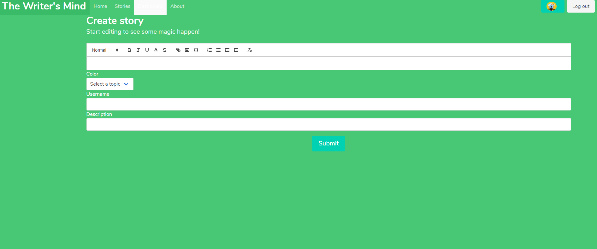
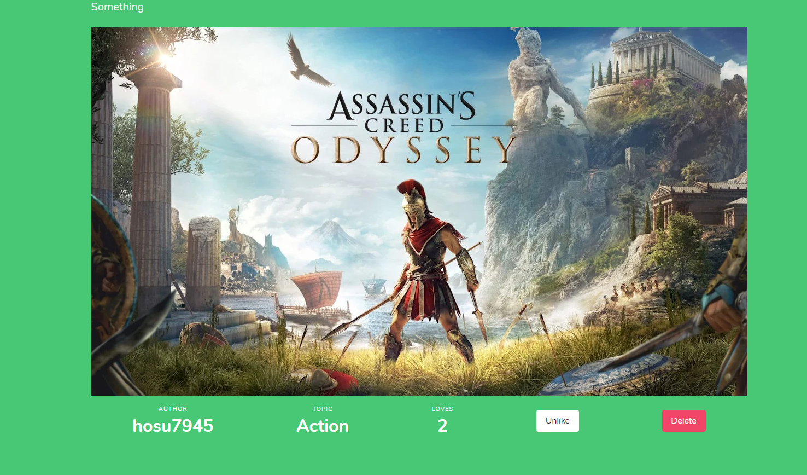

# Social Application written in React

> Social Application with the JWT base authorization system, wchich allows create posts and liked them.

## Table of contents

- [General info](#general-info)
- [Screenshots](#screenshots)
- [Technologies](#technologies)
- [Build Process](#setup)
- [Features](#features)
- [Status](#status)
- [Inspiration](#inspiration)
- [Contact](#contact)

## General info

Motivation to create this project was a desire to train my coding javascript skills and craete some portfolio project.

## Screenshots

- Home Page

- Dashboard Page

- Story Page

## Technologies

- react
- redux
- redux-thunk
- circle-ci
- formik
- axios
- jest
- redux-mock-store
- enzyme

## Build Process

- `npm install` to install dependencies
- `npm run` to run application
- `npm test` to run all tests
- `npm build` to build application

## Features

- Recreate the layout of application with the material-ui library
- Rewrite tests for the stories features

## Status

Project is: _in progress_

[Deployed App](https://mind-writer-client.herokuapp.com)

## Inspiration

[Jason Watmore Blog](https://jasonwatmore.com/post/2019/04/06/react-jwt-authentication-tutorial-example)

## Contact

Created by [@hosu794]- feel free to contact me: szczesnygrzegorz794@gmail.com.
