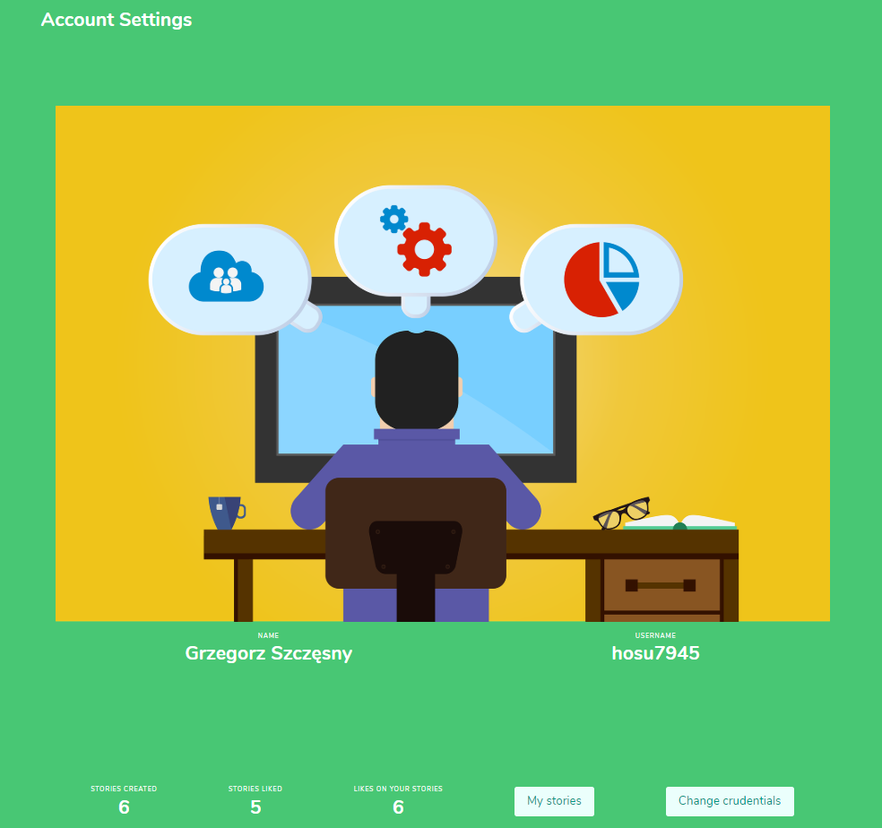

# Social Application written in React
> Social Application with the JWT base authorization system, wchich allows create posts and liked them. 

## Table of contents
* [General info](#general-info)
* [Screenshots](#screenshots)
* [Technologies](#technologies)
* [Setup](#setup)
* [Features](#features)
* [Status](#status)
* [Inspiration](#inspiration)
* [Contact](#contact)

## General info
Motivation to create this project was a desire to train my coding javascript skills and craete some portfolio project.

## Screenshots

## Technologies
* React - version 16.13.1
* Redux - version 4.0.5
* Redux-thunk - version 2.3.0
* CircleCi - version 2.0

## Setup
To run application just type "npm install" and "npm start"

## Code Examples
Show examples of usage:
`put-your-code-here`

## Features
Write features ready and TODO list for future development

## Status
Project is: _in progress_

## Inspiration
Add here credits. Project inspiration by..., based on...

## Contact
Created by [@hosu794](szczesnygrzegorz794@gmail.com) - feel free to contact me!
